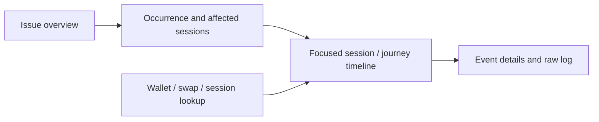

# Logging plans, implementation, and dashboard review

**2026-09-09 issue-quality update:** [Implementation and verification](issue-improvements.md) supersedes the historical findings below for normalized dashboard grouping, message/type search, triage columns, diagnostics separation, generic-error progress isolation, retry dedupe and causal-ID propagation on the covered paths. New frontend fields remain source/local-test evidence until deployed and recaptured; historical fixtures are unchanged. Source-map resolution and issue lifecycle state remain unverified/unimplemented.

Reviewed 2026-09-09 against the current working tree, including uncommitted changes.

## TL;DR

**Verdict: keep Faro/Loki and the current instrumentation foundation; fix event correctness and redesign the investigation workflow before expanding dashboards.**

The dashboard exposes too much of the telemetry implementation to its operator. A useful default experience should answer: what is recurring, which recorded sessions are affected, and what happened around one occurrence? Today it requires navigating exception types, message variants, multiple independent tables, and a wide timeline far down the page.

Two implementation defects were reproduced locally: repeated wallet rejections disappear across attempts, and sparse handled errors erase useful swap context before exception capture. The selected-session timeline can also omit the very error being investigated because it retrieves the oldest 1,000 records.

Priorities and estimates below are engineering estimates, not commitments. “Blocking” means a prerequisite for trusting the affected telemetry/dashboard behavior in an operational rollout; it does not mean the swap application itself cannot run.

| Priority | Change | Classification | Estimate |
| --- | --- | --- | --- |
| P1 | Retain repeated wallet outcomes across attempts | Blocking for accurate attempt/rejection investigation | 2–4 hours for narrow fix and regressions |
| P1 | Preserve current route/form context when capturing sparse errors | Blocking for reliable error context | ½–1 day |
| P2 | Anchor timeline to selected occurrence and expose result limits | Blocking for claiming complete investigation coverage | 1 day |
| P2 | Replace fixed test defaults and reduce dashboard density | Recommended immediately | 1–2 days including browser acceptance |
| P2 | Make pasted-message filtering and row serialization robust | Blocking for supported arbitrary message search/rendering | 1 day |
| P2 | Separate deployment identity from API mode and verify release/source maps | Production rollout prerequisite | ½–1 day plus deployment access |
| P2 | Run logging/dashboard regression suites in CI | Recommended before merge | ½ day including workflow/runtime validation |

## Confirmed implementation findings

### 1. P1 — A second identical wallet rejection is dropped

Evidence: [faro-swap-lifecycle.ts:225](../lib/faro-swap-lifecycle.ts#L225), especially the fingerprint and early return at lines 237–240. Wallet outcomes are not repeatable steps, and their fingerprint does not include the wallet-prompt attempt.

Reproduced with the actual controller:

```text
prompt opened, attempt 1
wallet action rejected, attempt 1
prompt opened, attempt 2
wallet action rejected, attempt 2  -> omitted
```

The last recorded state remains `wallet_prompt_opened`. Its timer remains scheduled because the return occurs before timer cleanup, so the record can later suggest a stalled prompt even though the user already rejected it. The same issue affects identical failures or successful repeated actions sharing the current fingerprint.

For the narrow wallet-prompt case, add the existing attempt counter to the fingerprint in `record`:

```ts
const fingerprint = JSON.stringify([
    state.attempt,
    event.step,
    event.swapId,
    event.outcome,
    event.reasonCode,
    event.transactionHash,
    event.inputTransactionHash,
    event.outputTransactionHash,
    event.refundTransactionHash,
    event.status,
    event.phase,
])
```

This suggested change was tested in an isolated in-memory copy: both attempts survive and duplicate rejection notifications within each attempt remain suppressed. It was not applied to application source. It does not solve connection/network-switch attempts that lack a wallet-prompt increment, or late results from an older asynchronous operation. The durable solution is an immutable operation ID and attempt number carried from action start through its result. Add a timer regression and connection/network-switch retry cases as part of that work.

### 2. P1 — Error capture discards the route context it is supposed to explain

Evidence: [WidgetWrapper.tsx:236](../components/WidgetWrapper.tsx#L236) constructs a sparse `flow_error`, calls the lifecycle recorder, then calls `logError`. [faro-swap-lifecycle.ts:264](../lib/faro-swap-lifecycle.ts#L264) replaces all swap-owned session attributes with that sparse event.

A local reproduction started a form with source/destination networks, tokens, requested amount and destination address, then emitted the same shape as a generic balance error. The journey ID and supplied source network survived; destination network, amount and destination address disappeared. The exception immediately captured by the wrapper therefore loses those session fields. Historical lifecycle rows still contain them, but operators must reconstruct them manually.

Separate two concepts in the controller:

- Current form/swap snapshot: route, tokens, amount, addresses and swap identity, updated from authoritative form/swap state and cleared on departure or a new journey.
- Event details: step, operation, outcome, error, hashes and timings, attached to the event that owns them.

Compose session context from the current snapshot plus the current progress state. A sparse error must not erase known snapshot fields or overwrite progress merely because it was observed. Avoid changing replacement into an unrestricted merge: that would reintroduce stale reasons and hashes. Explicitly clear snapshot fields on route/form changes and on a different journey.

Related architectural issue: all handled widget errors become `flow_error`, even background balance/API errors, and ordinary `record` calls clear progress timers. One transfer failure can appear as `wallet_action_failed`, then `flow_error`, then an exception; an API interceptor can contribute another handled error. These are different observations of one operation, not necessarily different incidents. Add an operation/error occurrence identity, retain diagnostic detail, and group those observations in the timeline. Keep generic/background diagnostics out of the progress state machine.

## Dashboard findings and recommended changes

### 3. P2 — A selected recent error can be outside the displayed timeline

Evidence: [faro-dev-vertical-slice.json:1668](faro-dev-vertical-slice.json#L1668) uses a forward query with `maxLines: 1000`. [faro-dashboard-types.md:23](faro-dashboard-types.md#L23) explicitly records that the broad verification timeline reached that bound.

The examples panel selects recent errors, but the timeline retrieves the oldest matching session records across the selected window. Sorting those results does not recover the missing recent records or recovery activity.

Start session investigation around the selected occurrence's **stored** timestamp, retain a link back to the overview's original time range, and offer wider/earlier/later windows or Explore. Show the returned record count and a visible “limit reached; activity may be missing” state when it reaches the cap. Do not call a timeline complete without proving coverage. Client timestamps remain useful display fields; they should not silently become Loki query-time bounds.

### 4. P2 — The saved investigation is still a test worksheet

Evidence: [investigation defaults](faro-dev-vertical-slice.json#L18) retain September 8, 07:50–08:30 UTC and the [controlled-test marker](faro-dev-vertical-slice.json#L132). Overview links override these, but opening the investigation bookmark directly excludes fresh unrelated errors.

Immediate, copy-paste-ready default fragment:

```json
"time": { "from": "now-24h", "to": "now" }
```

For the existing `error_marker` textbox, use:

```json
"current": { "selected": true, "text": "", "value": "" },
"query": ""
```

Keep controlled captures as named verification links. Reset dependent type/variant/session/event selections when their parent scope changes. The current documents explicitly require the operator to reset stale selections manually.

The [timeline starts at grid y=32](faro-dev-vertical-slice.json#L1362), under error variants, examples, matching sessions, wallet lookup and broad journey activity. Its organize configuration exposes 19 fields. Raw details start at y=44. The broad journey feed does not follow the selected session, making adjacent panels describe different populations.

Recommended information architecture:



| Surface | Default content | Keep behind selection/details |
| --- | --- | --- |
| Issue overview | Readable issue summary, affected recorded sessions, error records, latest occurrence, trend | Exception class, raw hash, full provider message |
| Investigation | Selected session/journey, route and wallet context, focused timeline | Other journeys, background HTTP/measurements, raw context |
| Support lookup | Identifier search and matching sessions; reuse the same investigation destination | Global error statistics and unrelated journey feed |

Use about six timeline columns: **Time, What happened, Outcome, Operation, Journey, Duration**. Duration must state what it measures and remain blank where unavailable; current previous-step duration is not automatically operation duration. Details hold stack, request URL, wallet connector, transaction IDs and trace IDs. Use an “Important activity / All signals” control and a journey selector, preserving access to surrounding evidence.

The overview's type-first grouping is an improvement over exposing hashes, but a library class is still a poor final issue identity. The saved evidence shows `ContractFunctionExecutionError` encompassing 23 records across four recorded sessions and 19 message/hash variants. Group by a stable normalized operation/reason plus a meaningful stack fingerprint when verified; display a representative readable summary. Do not infer root cause from the exception class or collapse distinct failures merely because their messages resemble each other.

Use explicit states: choose a session, no matching records, collection unavailable/stale, query failed, and result limit reached. Add collection freshness/coverage before treating zero errors as health. Keep operational caveats in tooltips/help and the review documentation, leaving only decision-relevant warnings on the main screen.

### 5. P2 — Error text has unsupported escaping cases

Evidence: the dashboard uses `${error_marker:doublequote}` for literal search and Go `printf "%q"` to manufacture JSON later consumed by Grafana's JSON extraction. [Current documentation](faro-dashboard-types.md#L31) acknowledges both limitations.

Grafana's doublequote formatter escapes quotation marks; it is not complete LogQL string serialization for pasted backslashes/control characters. [Grafana variable formatting](https://grafana.com/docs/grafana/latest/visualizations/dashboards/variables/variable-syntax/#doublequote). Separately, Go quoting can emit escapes that JSON does not accept.

Use a supported literal-search interpolation path and field extraction/serialization that does not equate Go quoting with JSON. Until that path is verified, explicitly constrain the text input and retain a reliable raw-log fallback. Validate actual Grafana rendering with quotes, Windows-style paths, newlines, ANSI/control characters and Unicode. URL encoding is already useful and does not solve either query or display serialization. These need integration verification; a replacement formatter should not be guessed from its name.

### Legacy dashboard: archive until its metrics are redesigned

[swap-lifecycle-dashboard.json:494](swap-lifecycle-dashboard.json#L494) computes completion percentage from completions and submissions independently observed within a time window. Completions can belong to journeys started before that window; selecting a swap ID also removes pre-creation form submissions. The resulting percentage is not a cohort conversion rate and can exceed 100% or lose its denominator.

This dashboard is explicitly excluded from the published development slice. Its problems must not be attributed to the active overview. Mark it as archived/unvalidated in its title and directory, or remove the misleading percentage before reuse. Define a started-journey cohort and observation horizon if browser conversion is needed. For actual swap completion/settlement health, use authoritative backend outcomes; a closed browser cannot observe subsequent settlement. Keep failure/rejection/stall observations separate from mutually exclusive final outcomes.

## Logging plan improvements

### Keep the foundation and simplify its contract

Keep the OTLP-aware sanitizer, explicit wallet/swap field ownership, dev versus optimized-build verbosity, typed lifecycle vocabulary, preserved useful URLs/addresses, and sanitized paired fixtures. Those are strong design choices.

Add a small event envelope with schema version, event/operation identity, operation attempt, event-local journey/swap identity, and normalized reason where the emitting operation knows them. Use explicit application operations rather than generating synthetic long-running journey spans. Direct causal tracing can remain deferred while Loki investigation becomes useful.

The current sanitizer limits depth and individual strings, but traverses unbounded array/object width; `logError` accepts arbitrary remaining error details and response bodies. Add a total per-record byte/field budget and bounded provider diagnostics while retaining the useful identifiers and URL behavior already selected in the plans. Preserve envelope/OTLP structure when truncating and expose truncation/drop counts through a nonrecursive mechanism. Measure bytes per recorded session and signal family before selecting a budget. Estimate: 1 day plus browser payload verification.

### 6. Deployment identity and source-map acceptance

[faro.ts:77](../lib/faro.ts#L77) labels environment using `NEXT_PUBLIC_API_VERSION`; version falls back to `local`. Mainnet/testnet is API mode, not deployment identity. An optimized development build can legitimately use mainnet and share those values with unrelated telemetry.

Derive a reliable deployment identity and immutable release from the existing build/deployment pipeline; keep API mode as a separate field and expose it separately in filters. This need not introduce another manually required Faro setting. Align the release identifier with source-map delivery. Require one known minified error to resolve to its original file/line in the receiver for the same release. Generating/serving a map alone does not prove that. These are already acknowledged rollout gaps, not newly claimed runtime failures.

### Coverage before sampling cuts

Keep the current default unchanged during an explicitly budgeted pilot. A proposed 5% Faro session sample would also lose the errors and wallet history of unsampled sessions; it is unsuitable if operators expect exhaustive support lookup. Faro discards all signals for unsampled sessions. [Faro sampling documentation](https://grafana.com/docs/grafana-cloud/observe-and-act/monitor-applications/frontend-observability/configure/sampling/).

Measure ingestion volume and noise first; reduce redundant diagnostics and background volume before deciding on reduced support coverage. An independent always-on error path would be additional implementation, not a capability currently available here. Even a configured 100% sample does not guarantee browser delivery.

Keep session/journey/swap IDs, addresses, hashes and raw URLs searchable as record fields. Do not promote them to ingestion labels or persistent metric dimensions. Bounded deployment/application dimensions can improve selectors after inspecting the receiver configuration and cardinality. [Loki label guidance](https://grafana.com/docs/loki/latest/get-started/labels/). Aggregate error-record counts must remain distinguishable from unique sessions and incidents. [LogQL aggregation semantics](https://grafana.com/docs/loki/latest/query/metric_queries/).

### 7. CI and acceptance criteria

The repository workflow search found no invocation of the Faro suite or the specific dashboard/logger regression files. Add a bridge logging validation job with the appropriate path triggers, compatible Node runtime, frozen dependency install and workspace prerequisites. Suggested commands after setup:

```sh
pnpm --filter @layerswap/bridge test:faro
node --test apps/bridge/grafana/tests/faro-dev-vertical-slice.test.mjs packages/widget/core/tests/log-store.test.mjs
pnpm --filter @layerswap/bridge exec tsc --noEmit --incremental false
```

The dashboard tests validate configuration and modeled behavior; they do not execute Grafana interpolation/rendering. Acceptance should include an actual type/issue → occurrence → session → event round trip, a selected error beyond the first 1,000 session records, missing IDs, repeated attempts, stale scope selections, unusual message characters and empty/query-error states. Browser restoration/two-tab behavior and source-map resolution remain separate checks.

### Replace superseding prose with one current plan

Keep a short authoritative status table with capability, implementation status, browser verification, Loki verification, production verification, next acceptance check and owner. Link evidence once; move the historical checkpoint narrative into an archive. Several files contain both current updates and now-obsolete pending/current-behavior descriptions, making it unnecessarily difficult to determine what remains undone.

Recommended delivery order:

1. Fix repeated outcomes and context loss; add boundary regressions and CI.
2. Correct defaults, focus the timeline, expose truncation and reduce visible fields; complete browser acceptance.
3. Add operation-based grouping and correlation, payload budgets, release identity and receiver source-map validation.
4. Establish representative production volume/coverage baselines; then decide sampling, aggregate metrics and alerts.

Preserve the existing choices in the plans: useful full URLs and connected-wallet history remain available; dedicated RPC/balance/gas dashboards and Tempo remain deferred. A general investigation workflow should improve first.

## Verification and scope

- 48 Faro tests passed.
- 34 dashboard, RPC remediation and logger tests passed (14 + 16 + 4).
- Actual-controller probes reproduced repeated-rejection loss and sparse-error context loss.
- The suggested narrow fingerprint change passed an isolated two-attempt/within-attempt-deduplication probe. An initial in-memory import failed because type stripping retained an empty package import; the corrected isolated harness removed that type-only dependency before executing. No application patch was applied.
- Reviewed saved dashboard queries, layouts, links and documented browser/Loki evidence. Live dashboard navigation reached Microsoft sign-in; current rendered appearance and clicks were not verified in this review.
- No application build or TypeScript check was run in this review because application source was not changed. Earlier documents' build/typecheck claims are historical evidence, not results from this review.
- No frontend, dashboard or infrastructure was published. The existing implementation changes were preserved.
- The `.cursor` review coordinator and React skill referenced in `AGENTS.md` are absent. The review used direct full-file inspection and an independent dashboard review rather than claiming those missing workflows ran.
